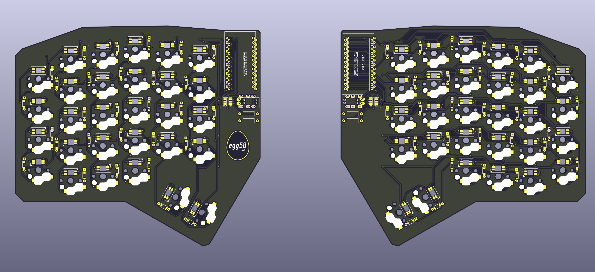

# egg58

The egg58 is a staggered-column, split, low-profile keyboard with 58 keys and per-key RGB. The PCB is reversible (i.e. the same part is used for both hands). This repository contains its design files.

## Overview

The egg58 v2 is a full redesign from the first revision. Prototypes have now arrived the keyboard is tested and working.

Some changes from the first version include:
- Original Chocs are used rather than Choc v2
- There is an option to use soft serial instead of I2C for the bridge transport
- The Elite-C microcontroller is now supported in addition to the Pro Micro
- The LEDs are now north-facing (since that is more suitable for the only shine-through caps for Choc currently available)
- The thumb cluster is now designed for 2x 1.5u instead of one 1.5u and one 2u key.

The layout and stagger are largely the same, with the exception that keys now use Choc spacing instead of MX. Be aware of this when purchasing keycaps.

Firmware is available using my [fork of QMK](https://github.com/tmick0/qmk_firmware/tree/egg58/keyboards/egg58).

## Layout

The egg58 was designed to remain fairly close in layout to an ANSI 60% keyboard, but with a reduced number of keys and
minimal thumb clusters.

This is a suggested layout, but obviously it is customizable.

## Materials

- 2x PCB (from this repo)
- 2x switchplate (from this repo)
- 2x Pro Micro or Elite-C 
- 2x 4.7K through hole resistors (for I2C option)
- 2x 3.5mm TRRS jack (PJ-320A)
- 58 Choc sockets
- 58 Choc switches (Choc V1 only)
- 58 diodes (1N4148 or similar, throughhole or SOD123)
- 58 SK6812 Mini-E LEDs
- 1x TRRS cable

## Build instructions

On the back of each board:

- Install LEDs such that the notched corner aligns with the indicator on the silkscreen.
  - Be aware that the orientation of the LEDs changes each row.
- Install diodes, such that the cathode (the side with the line) points toward the square holes (upward). 
  - If using through-hole diodes with the FR4 switchplate, ensure that the leads are trimmed very short on the front, otherwise they may scratch through the switchplate solder mask and short out.
- Install sockets.
- If I2C is being used, install the two resistors beneath the location for the TRRS.
  - Recommended to use either 2x 4.7K on a single hand, or 4x 10K on both hands.
  - The values are fairly flexible, as long as the total resistance on each line is between 2.2K-10K.
- Solder the two jumpers to select serial/I2C and Elite-C/Pro Micro.

On the front:

- Install TRRS.
- Install MCU (preferably in a socket).

Mount the switchplate to the PCB with 5x M2 screws. A spacer is recommended between the two layers. Install switches in the sockets.

## Firmware

My [fork of QMK](https://github.com/tmick0/qmk_firmware/tree/egg58/keyboards/egg58) contains default configuration and a keymap for the board.

The configuration will need to be changed if using soft serial instead of I2C, or if your microcontrollers do not use the DFU bootloader.

## License

This repository is available under the terms of the [GPL, verison 3](LICENSE).

Some portions are derived from:

- [keyswitches.pretty](https://github.com/daprice/keyswitches.pretty) ([CC BY-SA 4.0](https://creativecommons.org/licenses/by-sa/4.0/))
- [Keebio-Parts.pretty](https://github.com/keebio/Keebio-Parts.pretty) ([MIT](https://github.com/keebio/Keebio-Parts.pretty/blob/master/LICENSE))
- [ProMicroKiCad](https://github.com/Biacco42/ProMicroKiCad) ([MIT](https://github.com/Biacco42/ProMicroKiCad/blob/master/LICENSE))
- [SofleKeyboard](https://github.com/josefadamcik/SofleKeyboard) ([MIT](https://github.com/josefadamcik/SofleKeyboard/blob/master/LICENSE))

